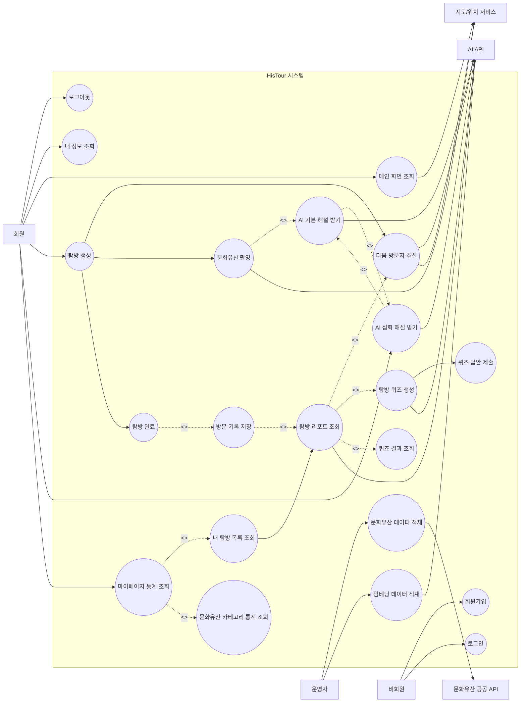

# HisTour Use-Case 다이어그램

## 1. 액터 정의

| 액터 | 설명 |
| --- | --- |
| 비회원 | 회원가입 또는 로그인을 수행하는 사용자 |
| 회원 | HisTour의 주요 기능을 이용하는 로그인 사용자 |
| 운영자 | 문화유산 데이터와 임베딩 데이터를 적재/관리하는 관리자 |
| 문화유산 공공 API | 문화유산 원천 데이터를 제공하는 외부 시스템 |
| AI API | 문화유산 식별, 해설, 퀴즈, 요약, 임베딩 생성을 수행하는 외부 AI 시스템 |
| 지도/위치 서비스 | 지도 표시, 현재 위치, 거리 계산에 활용되는 외부/브라우저 기능 |

## 2. Use-Case 다이어그램

## 3. 주요 Use-Case 명세

### UC-01 회원가입

| 항목 | 내용 |
| --- | --- |
| 주 액터 | 비회원 |
| 목적 | 서비스 이용을 위한 계정을 생성한다. |
| 선행 조건 | 사용자가 로그인되어 있지 않다. |
| 기본 흐름 | 사용자가 이메일, 비밀번호, 닉네임을 입력한다. 시스템은 입력값을 검증하고 계정을 생성한다. |
| 예외 흐름 | 이미 존재하는 이메일이거나 입력값이 유효하지 않으면 오류 메시지를 표시한다. |
| 결과 | 신규 사용자 계정이 생성된다. |

### UC-02 로그인

| 항목 | 내용 |
| --- | --- |
| 주 액터 | 비회원 |
| 목적 | 인증 후 HisTour 기능을 이용한다. |
| 선행 조건 | 가입된 사용자 계정이 존재한다. |
| 기본 흐름 | 사용자가 이메일과 비밀번호를 입력한다. 시스템은 인증 후 Access Token과 Refresh Token을 발급한다. |
| 예외 흐름 | 인증 정보가 일치하지 않으면 로그인 실패 메시지를 표시한다. |
| 결과 | 사용자는 메인 화면으로 이동한다. |

### UC-03 탐방 생성

| 항목 | 내용 |
| --- | --- |
| 주 액터 | 회원 |
| 목적 | 문화유산 탐방 단위를 생성한다. |
| 선행 조건 | 사용자가 로그인되어 있다. |
| 기본 흐름 | 사용자가 탐방 제목과 날짜를 입력한다. 시스템은 진행 중인 탐방 중복 여부를 확인하고 새 탐방을 생성한다. |
| 예외 흐름 | 이미 진행 중인 탐방이 있으면 생성을 거부한다. |
| 결과 | 진행 중 상태의 탐방이 생성된다. |

### UC-04 AI 기본 해설 받기

| 항목 | 내용 |
| --- | --- |
| 주 액터 | 회원 |
| 목적 | 현장에서 촬영한 문화유산에 대한 해설을 받는다. |
| 선행 조건 | 사용자가 로그인되어 있고, 카메라 및 위치 권한이 허용되어 있다. |
| 기본 흐름 | 사용자가 문화유산을 촬영한다. 시스템은 이미지와 위치를 AI API에 전달하여 문화유산을 식별하고 기본 해설을 생성한다. 탐방 중이면 방문 기록을 저장한다. |
| 예외 흐름 | 위치 반경 내 문화유산이 없거나 AI가 대상을 식별하지 못하면 오류 메시지를 표시한다. |
| 결과 | 문화유산명, 기본 해설, 방문 기록 ID가 반환된다. |

### UC-05 AI 심화 해설 받기

| 항목 | 내용 |
| --- | --- |
| 주 액터 | 회원 |
| 목적 | 기본 해설 이후 더 깊은 설명을 확인한다. |
| 선행 조건 | 기본 해설 및 방문 기록이 존재한다. |
| 기본 흐름 | 사용자가 심화 해설을 요청한다. 시스템은 기존 방문 기록과 문화유산 정보를 기반으로 AI 심화 해설을 생성하거나 저장된 내용을 반환한다. |
| 예외 흐름 | 방문 기록 ID가 유효하지 않으면 요청을 거부한다. |
| 결과 | 선택 주제 또는 종합 심화 해설이 제공된다. |

### UC-06 다음 방문지 추천

| 항목 | 내용 |
| --- | --- |
| 주 액터 | 회원 |
| 목적 | 현재 탐방 흐름에 맞는 다음 문화유산을 추천받는다. |
| 선행 조건 | 진행 중인 탐방과 방문 기록이 존재하며, 임베딩 데이터가 적재되어 있다. |
| 기본 흐름 | 사용자가 추천을 요청한다. 시스템은 현재 위치, 방문 이력, 임베딩 유사도를 기준으로 미방문 문화유산을 추천한다. |
| 예외 흐름 | 위치 정보가 유효하지 않거나 추천 후보가 없으면 안내 메시지를 표시한다. |
| 결과 | 추천 문화유산 목록과 거리 정보가 제공된다. |

### UC-07 탐방 완료

| 항목 | 내용 |
| --- | --- |
| 주 액터 | 회원 |
| 목적 | 진행 중인 탐방을 종료한다. |
| 선행 조건 | 사용자의 진행 중 탐방이 존재한다. |
| 기본 흐름 | 사용자가 탐방 완료를 선택한다. 시스템은 탐방 상태를 완료로 변경한다. |
| 예외 흐름 | 이미 완료된 탐방이면 요청을 거부한다. |
| 결과 | 탐방 상태가 완료로 변경되고 퀴즈/리포트 이용이 가능해진다. |

### UC-08 탐방 퀴즈 풀이

| 항목 | 내용 |
| --- | --- |
| 주 액터 | 회원 |
| 목적 | 방문한 문화유산 내용을 복습한다. |
| 선행 조건 | 완료된 탐방과 방문 기록이 존재한다. |
| 기본 흐름 | 사용자가 퀴즈를 시작한다. 시스템은 탐방 방문 기록 기반 퀴즈를 생성 또는 조회한다. 사용자가 답안을 제출하면 시스템은 채점 결과와 해설을 제공한다. |
| 예외 흐름 | 퀴즈가 이미 제출된 세션이면 안내 메시지를 표시한다. |
| 결과 | 정답 수, 정답률, 문항별 채점 결과가 저장된다. |

### UC-09 탐방 리포트 조회

| 항목 | 내용 |
| --- | --- |
| 주 액터 | 회원 |
| 목적 | 완료된 탐방의 방문 결과를 요약해서 확인한다. |
| 선행 조건 | 완료된 탐방과 방문 기록이 존재한다. |
| 기본 흐름 | 사용자가 리포트를 조회한다. 시스템은 방문 문화유산 목록, 추천 코스, AI 요약을 생성하여 반환한다. |
| 예외 흐름 | 사용자의 탐방이 아니거나 탐방 정보가 없으면 접근을 거부한다. |
| 결과 | 탐방 리포트가 표시된다. |

### UC-10 마이페이지 통계 조회

| 항목 | 내용 |
| --- | --- |
| 주 액터 | 회원 |
| 목적 | 자신의 탐방 기록과 방문 성과를 확인한다. |
| 선행 조건 | 사용자가 로그인되어 있다. |
| 기본 흐름 | 사용자가 마이페이지에 접근한다. 시스템은 프로필, 방문 갤러리, 시대별/카테고리별 통계를 제공한다. |
| 예외 흐름 | 인증 정보가 만료되면 로그인 화면으로 이동한다. |
| 결과 | 사용자의 누적 탐방 활동이 표시된다. |

### UC-11 문화유산 데이터 적재

| 항목 | 내용 |
| --- | --- |
| 주 액터 | 운영자 |
| 목적 | 서비스에 필요한 문화유산 기본 데이터를 구축한다. |
| 선행 조건 | 문화유산 공공 API 키와 DB 연결 정보가 설정되어 있다. |
| 기본 흐름 | 운영자가 데이터 적재 설정을 활성화한다. 시스템은 공공 API에서 문화유산 데이터를 수집하여 DB에 저장한다. |
| 예외 흐름 | 외부 API 호출 실패 또는 DB 저장 실패 시 로그를 남기고 적재를 중단한다. |
| 결과 | 문화유산 기본 데이터가 DB에 저장된다. |

